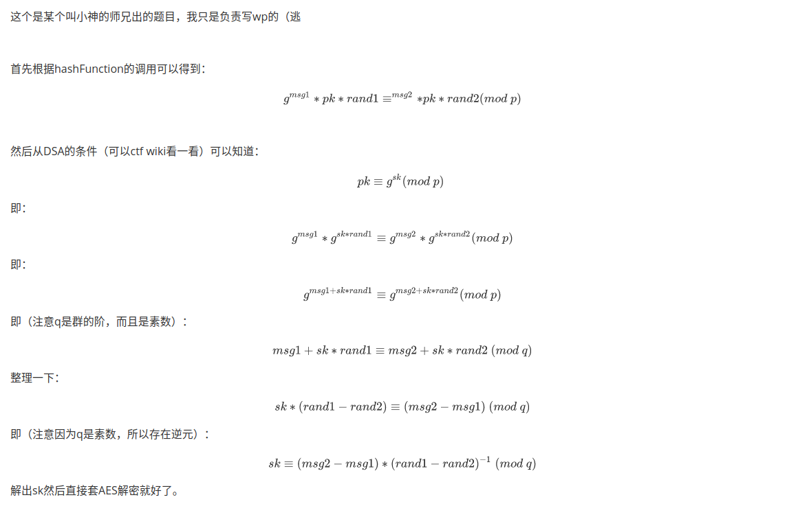

题名：Chameleon hash
描述：Crypto不是会数学就行？
hints：（无）

flag: HSCTF{chame1e0n_ha5h_i5_4un}

PS：这个是小神师兄出的题（逃

---

<!--
这个是某个叫小神的师兄出的题目，我只是负责写wp的（逃

首先根据hashFunction的调用可以得到：
$$
g^{msg1}*pk*{rand1} \equiv ^{msg2}*pk*{rand2} (mod\ p)
$$

然后从DSA的条件（可以ctf wiki看一看）可以知道：
$$
pk \equiv g^{sk} (mod\ p) \
$$
即：
$$
g^{msg1}*g^{sk*rand1} \equiv g^{msg2}*g^{sk*rand2} (mod\ p)
$$
即：
$$
g^{msg1+sk*rand1} \equiv g^{msg2+sk*rand2} (mod\ p)
$$
即（注意q是群的阶，而且是素数）：
$$
msg1+sk*rand1 \equiv msg2+sk*rand2\ (mod\ q)
$$
整理一下：
$$
sk*(rand1-rand2) \equiv (msg2-msg1)\ (mod\ q)
$$
即（注意因为q是素数，所以存在逆元）：
$$
sk \equiv (msg2-msg1)*(rand1-rand2)^{-1}\ (mod\ q)
$$
解出sk然后直接套AES解密就好了。
-->