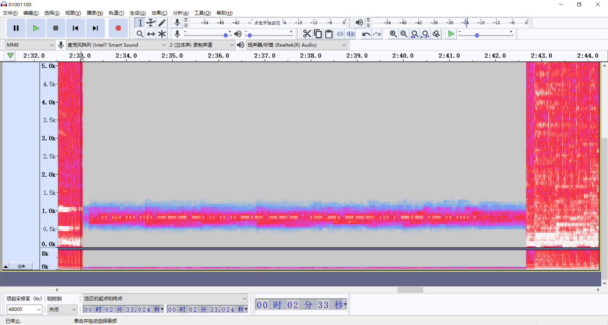
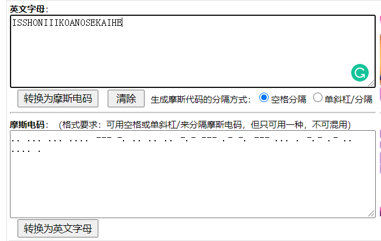
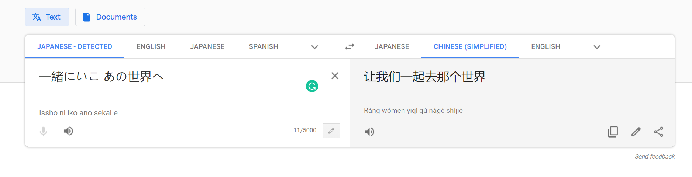
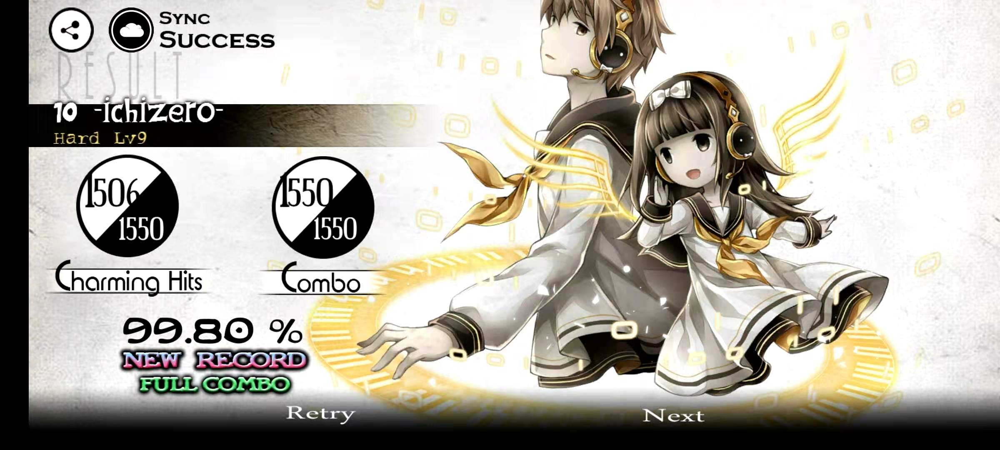

01001100.wav：题目文件
ans：答案

题名：ichizero
描述：让我们一起去那个世界！（hint：BV15W411V7JT）。flag格式：HSCTF{大写英文字母}
hints：
1. 2：30

flag：HSCTF{ISSHONIIIKOANOSEKAIHE}

---

Audacity打开拉到2：30处换频谱图，低通滤波800两次，高通滤波800两次，可以看到清晰的摩斯码，然后随便找个在线的解一下（其实中间某个地方有个停顿的）：

.. ... ... .... --- -. .. .. .. -.- --- .- -. --- ... . -.- .- .. .... .

ISSHONIIIKOANOSEKAIHE

顺便用了一下神奇的谷歌翻译：

一緒にいこ あの世界へ

然后题目提示了某个视频，社工一下其实deemo wiki上面是有这个讨论的（但不知道为什么只有英文版的wiki才有）

