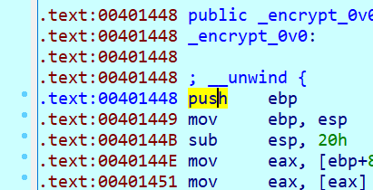

# Deliver_TEA_to_dalao

## 题目描述

你所看到的不一定是真实的（指反编译结果。

## 题目文件

`tqltql.exe`

## flag

flag{H4vE_gr3aT_7eA_Hah}

---

## Write up

其实名字有一点点暗示~~（给大佬递茶.jpg~~，毕竟TEA这么明显的大写，在搜索引擎里能查到TEA加密；并且很明显的可以看到，在代码保护上运用了smc技术（热身赛有好好看wp的队肯定能发现）。

> SMC(self-Modifying  Code 自修改代码)，就是在真正执行某一段代码时，程序会对自身的该段代码进行自修改，只有在修改后的代码才是可汇编、可执行的。在程序未对该段代码进行修改之前，在静态分析状态下，均是不可读的字节码，IDA之类的反汇编器无法识别程序的正常逻辑。

大概逻辑如图：


### Ⅰ. 通过patch伪修正

代码逻辑~~看起来~~比较简单，就是把输入的字符串v21经过一个加密函数以后跟已知字符串做对比而已。

然而看到加密函数的伪代码&&反汇编却发现乱七八糟的。


这时候我们可以猜测它**被smc技术保护**，实锤就是在上面一个不起眼(?)的`ignoreMe`函数里把加密函数所在的地址进行了xor。


也就是说，程序目前的`encrypt_0v0`部分的机器码是有问题的，需要通过这个xor函数以后程序才能正常进行。

那我们可以通过IDA自带的脚本功能进行patch，将那一部分的函数“修正”，让改函数能正常反编译，给我们呈现出这个部分的伪代码。

注意，**这里只是伪修正**，只改这里然后将patch的部分应用到输入文件的话程序是无法运行的，需要把xor函数nop（全部patch成90）才能消除影响（不过在这里正常运行似乎没什么必要x）。

我们找到`encrypt_0v0`部分，看到函数起始地址是0x401448，加密长度是189。

然后写出patch的exp：

```python
def patch(start,end,key):
    n=0
    while(start+n!=end+1):
        addr=start+n
        PatchByte(addr,Byte(addr)^key)
        n+=1
    print("%d Byte has been changed"%n)

codeStart=0x401448
codeLen=189
xorData=0x56
patch(codeStart,codeStart+codeLen-1,xorData)
```

点击File->Script file，导入脚本运行。


可以看到`encrypt_0v0`函数发生了变化，同时消息窗口有“189 Byte has been changed”字样。


点击Edit->Patch program->Apply patches to input file，将patch的部分应用到输入文件中（**便于让ida重新分析**）。


关掉，重新用ida打开，按`F5`进行反编译可得：


是显而易见的TEA加密形式（比如特殊常数0x9E3779B9或者0x61C88647）。

这里key是`[v4,v5,v6,v7]=[0x33221100,0x77665544,0xBBAA9988,0xFFEEDDCC]`。


明文是flag，密文是v8~v12转成的char数组：`{0xa8,0xa,0xe4,0xe3,0x13,0x5c,0xfa,0x8,0xd,0x5c,0xe1,0x90,0x25,0x12,0x76,0x36,0x51,0x10,0xc4,0x11,0xf6,0xd8,0xf8,0x82}`。

为什么不是`{0xe3,0xe4,0x0a,0xa8,...}`呢，这就要看它们在内存中的存储方式（小端序）了，具体自行搜索。


于是exp就可以写了：

```c
#include <stdio.h>
char flag[]={0xa8,0xa,0xe4,0xe3,0x13,0x5c,0xfa,0x8,0xd,0x5c,0xe1,0x90,0x25,0x12,0x76,0x36,0x51,0x10,0xc4,0x11,0xf6,0xd8,0xf8,0x82};
int key[]={0x33221100,0x77665544,0xBBAA9988,0xFFEEDDCC};
void decrypt(unsigned int * v, unsigned int * k){
    int i;
    unsigned int v0=v[0],v1=v[1],sum=0,delta=0x9e3779b9;
    sum=delta*32;
    for(i=0;i<32;i++){
        v1-=((v0<<4)+k[2])^(v0+sum)^((v0>>5)+k[3]);
        v0-=((v1<<4)+k[0])^(v1+sum)^((v1>>5)+k[1]);
        sum-=delta;
    }
    v[0]=v0;
    v[1]=v1;
    return;
}
int main(){
    int i;
    unsigned int * p_int=(unsigned int*)flag;
    for(i=0;i<6;i+=2) decrypt(&p_int[i],(unsigned int*)key);
    printf("%s",flag);
    return 0;
}

//flag{H4vE_gr3aT_7eA_Hah}
```

### Ⅱ. 动态调试直接看函数

对付smc，还可以考虑动态调试。

>  环境是IDA pro v7.0，高版本可以直接调试32位程序。

因为是32位程序，所以在ida目录下找到`.\dbgsrv\win32_remote.exe`，并打开：


然后用ida打开文件，点击Debugger->Select debugger选择：


然后点击Debugger->Process options调整设置（将Hostname设置成my ip就好）：


断点设在`call ignoreMe`后面，此时`encrypt_0v0`已被处理，是正常函数。


然后按`F9`，开始调试，调试开始后程序暂停在断点处。


点开`encrypt_0v0`，（按空格从图形界面转到文字）。


选中这一部分的汇编代码，按`c`强转成代码（->Force->Yes）。将还包括在函数体内的语句按`d`再按`c`。




然后选中刚才的地址区段，按`p`生成函数。


最后按`F5`反编译得到：


就可以看到加密函数了，后续解密步骤同Ⅰ。

其实这里从强转成代码开始的步骤同样适用于Ⅰ，只是相比之下直接重新打开ida让其重新分析更方便而已hhh。