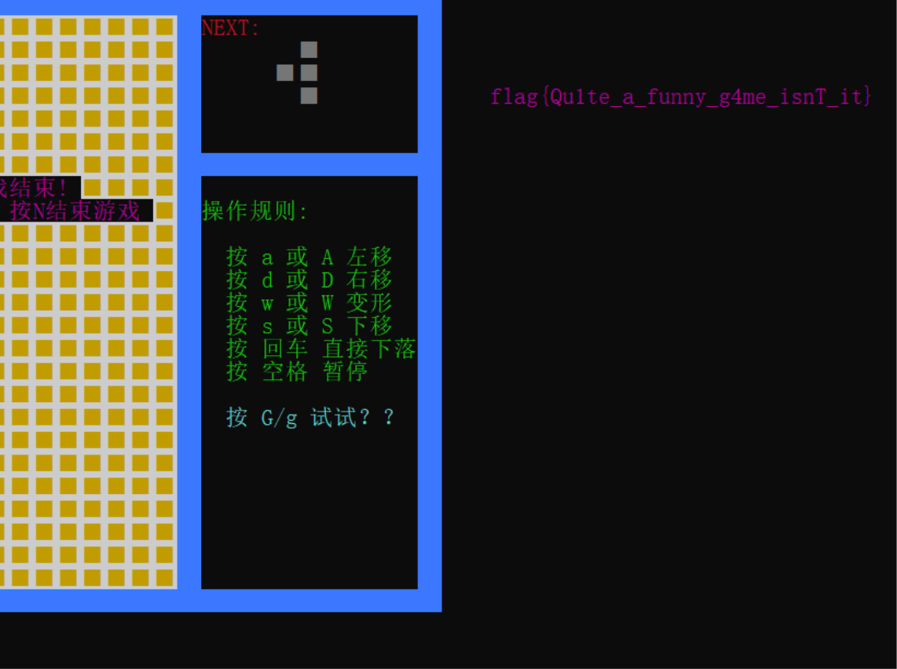
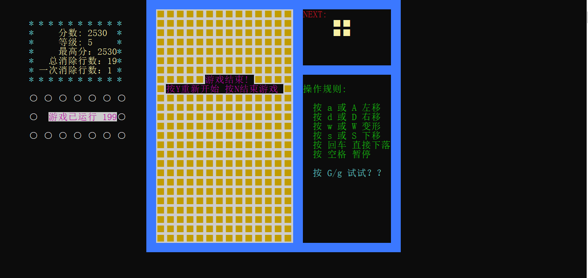
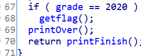
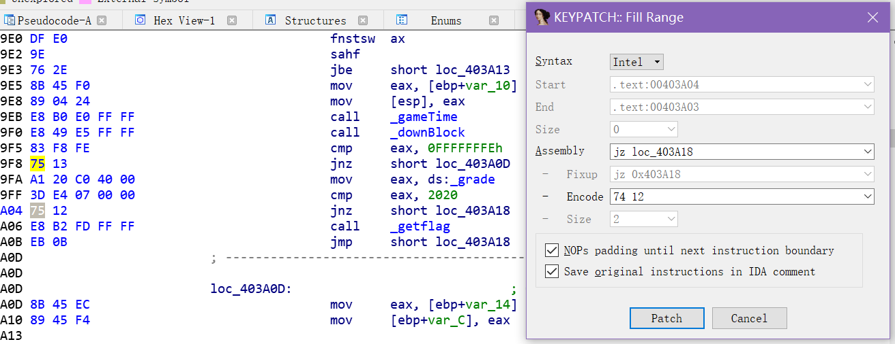
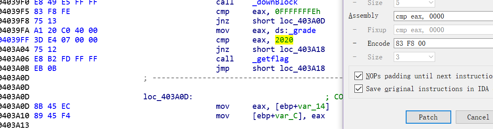
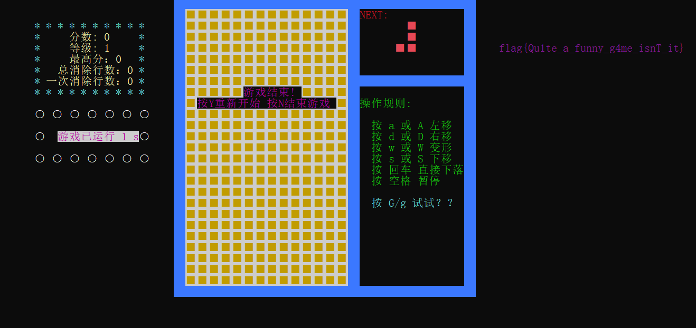
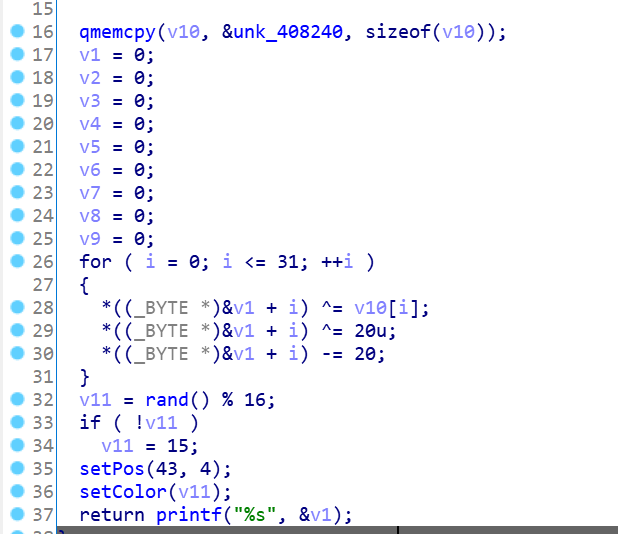

# Funny_game

## 题目描述

打得好不如打得巧 0v0

## 题目文件

`funny_game.exe`

## flag

flag{Qu1te_a_funny_g4me_isnT_it}

---

## Write up

多维度送分题（x） 

显而易见的俄罗斯方块，打块拿flag。 

### Ⅰ. 暴力打穿

打到2020分自行结束游戏后在屏幕右侧出flag。花个十几分钟大概就能出（



p.s. 一定要在刚好2020分的时候结束游戏才能出flag哦，不然也没有flag出来的（所谓打得好不如打得巧

~~自己打出来的反面教材↓（。）~~



### Ⅱ. 修改程序逻辑

在ida里按F5出伪代码，看到程序逻辑，



patch一下把if改成if not / 2020改成0 / ...

（如果ida有装[keypatch](https://github.com/keystone-engine/keypatch)这个插件的话就能直接通过更改汇编语句从而patch机器码；方法见->[IDA7.0安装keypatch和findcrypt-yara插件](https://www.cnblogs.com/zhaijiahui/p/7978897.html)）


↑ ① 相当于把if改成if not


↑ ② 把2020改成0

然后狂敲enter，1s拿flag。



### Ⅲ. 定位到getflag()逆向求解

查看到程序逻辑以后双击getflag()，或者直接在函数栏搜索flag定位到关键函数。

getflag()程序逻辑：



逆向写出exp：

```python
arr=[0x0000006E, 0x00000094, 0x00000061, 0x0000006F, 0x0000009B, 0x00000071, 0x0000009D, 0x00000051, 0x0000009C, 0x0000006D, 0x00000067, 0x00000061, 0x00000067, 0x0000006E, 0x0000009D, 0x00000096, 0x00000096, 0x00000099, 0x00000067, 0x0000006F, 0x0000005C, 0x00000095, 0x0000006D, 0x00000067, 0x00000069, 0x00000093, 0x00000096, 0x0000007C, 0x00000067, 0x00000069, 0x0000009C, 0x00000085]
flag=""
for i in range(32):
    tmp=(arr[i]^20)-20
    flag+=chr(tmp)
print(flag)

#flag{Qu1te_a_funny_g4me_isnT_it}
```

p.s. v1-v9在空间上是连续的，所以实际上这是一个长度为33（末尾有'\0'）的char型数组。