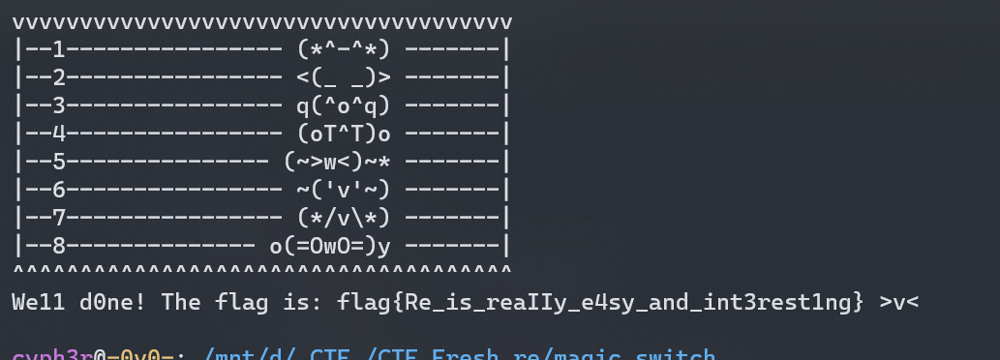
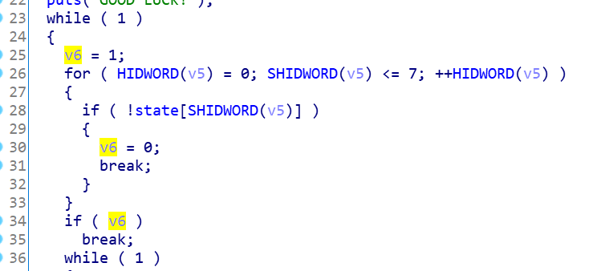
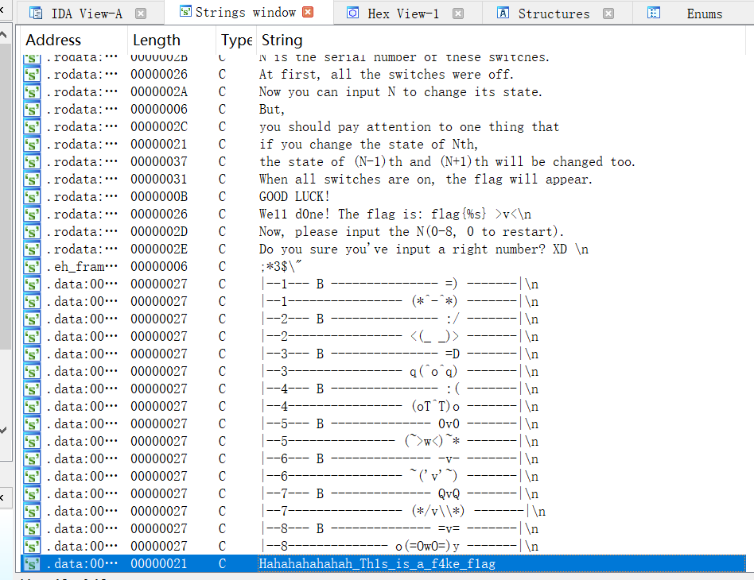
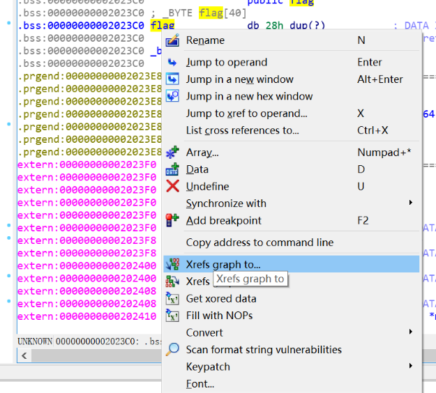
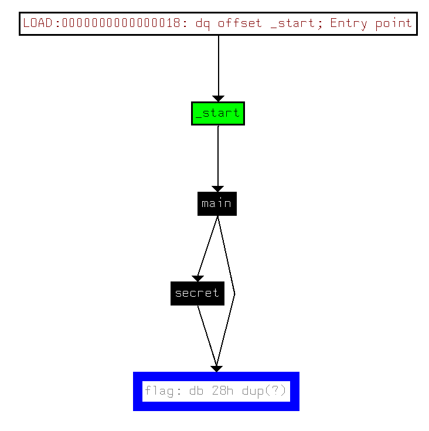
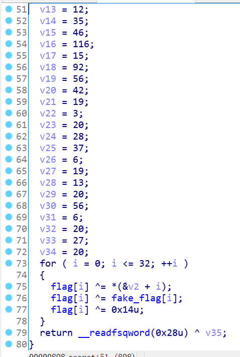

# Magic_switch

## 题目描述

快来跟可爱的颜文字一起玩耍吧~

## 题目文件

`magic_switch`

## flag

flag{Re_is_reaIIy_e4sy_and_int3rest1ng}

---

## Write up

还是送分题（linux下可直接打开

### Ⅰ. 随手乱糊

其实根据xor的特性，只要1-8每个数字都敲一次就能出flag（比如12345678）。当时出题的时候就在想会不会有队伍在wp里一脸懵逼地写“随便打就出来”的，没想到还真有哈哈哈。



### Ⅱ. 修改程序逻辑

可以看到程序逻辑是只要所有灯的状态都是1的时候，才能跳出`while(1)`死循环。



同funny_game，可以通过修改程序逻辑，把`if(v6)`改成`if(!v6)`，然后程序运行时在while执行的第一次就能跳出循环获得flag，不过完全没必要（。
有patch的功夫不如直接乱糊2333。

### Ⅲ. 定位到关键函数逆向求flag

按惯例按快捷键`shift+F12`，查看strings窗口，可以看到一个fake_flag，顾名思义是假flag（这一段没什么用，目的只是提一下IDA的常规操作罢辽）。



点进flag以后发现flag不是直接存储的，而是在某个函数里生成(?)的。  
进到反汇编窗口，右键flag数组，查询引用情况。



then可以看到一个神秘的secret函数。



secret()的函数逻辑如下。



在题目里，可以看到flag[]为全局变量（函数内没有声明/存储在bss段/在ida里显示变量名字），全局变量默认初始化为0。而任何数异或0都为它本身，故`flag[i]^=v2[i]`实际上等同于`flag[i]=v2[i]`。  
一个简单xor，解密思路跟funny_game相同，写出exp：

```python
v2=[14,16,35,28,15,42,14,16,29,60,53,12,35,46,116,15,92,56,42,19,3,20,28,37,6,19,13,20,56,6,20,27,20]
fake_flag="Hahahahahahah_Th1s_is_a_f4ke_f1ag"
flag=""
for i in range(33):
    tmp=v2[i]^ord(fake_flag[i])^20
    flag+=chr(tmp)
print(flag)

#Re_is_reaIIy_e4sy_and_int3rest1ng
```

这也说明了xor其实只是基操并非考点，考点还是ida的操作和阅读C代码的能力= =