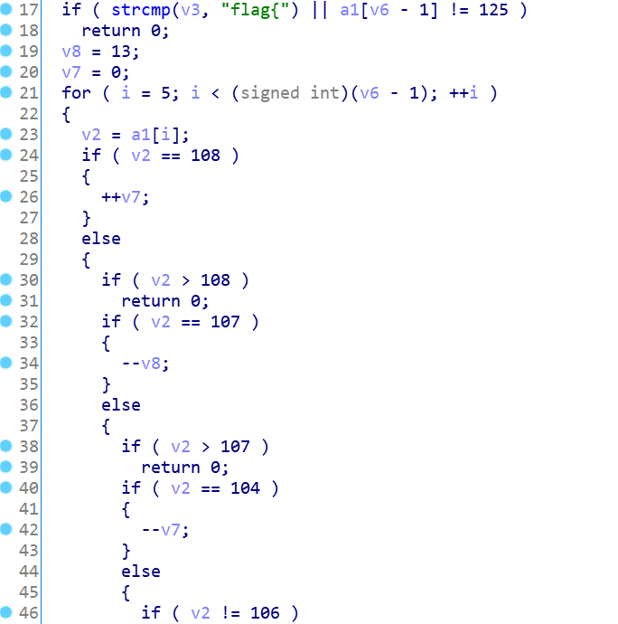

# Maze

## 题目描述

maze v.使困惑（？

## 题目文件

`maze.exe`

## flag

flag{llllkkkhhhkkkkkkkkklllljjjjllljjljjjjjjjlllkkkklljjjl}

---

## Write up

其实这道题是出题的时候所有题里面最先有思路的一道，并且也花了点心思往里塞了很多科普（可惜写的时候忽略了防输入其他字符的default，不过还是做到就是赚到hhh。

如果认真看过CTF Wiki的人（或者攻防世界里reverse新手区刷完的人），看到这个题目应该有条件反射吧0v0


### 那就直接maze套路走起吧


#### 1）在内存中布置一张“地图”

不同于常规的maze题目，本题的地图没有直接储存在全局变量中，而是由`CreateMap()`生成。


而这一串关键代码

```c
do{
    map[16 * i + 16 - v1] = v2 & 1;
    v2 >>= 1;
    result = (unsigned int)v1++;
}while ( (_DWORD)result && v1 <= 16 );
```

其实跟十进制转二进制的代码特别像（论熟悉进制转换的必要性

```c
int num,pos=1,binary[16]={0};
cin>>num;
do{
    binary[16-pos]=num&1;
    pos++;
}while(num>>=1);
```

所以其实就是把num数组里的数（先转成无符号数再）转成二进制按行存到地图里。

然后可以得到16*16的地图：


#### 2）将用户输入限制在少数几个字符范围内



可以看到，除了格式`flag{}`以外，其余的字符都由`h`、`j`、`k`、`l`组成，表示在迷宫内的上下左右移动。

那么，为什么选这四个字母来作为上下左右而不是常规的`↑↓←→`或者`wasd`呢？

因为在文本编辑器vim里，让光标上下左右移动的快捷键分别就是**h（左）、j（下）、k（上）、l（右）**。（掌握vim快捷键是linux端快速敲码的第一步噢0v0

#### 3）一般只有一个迷宫入口和一个迷宫出口

在迷宫画出来后，可以轻松看到唯一的出入口（入口在map\[13][0]、出口在map\[13][15]）。因为有限制长度为59，所以很大可能是迷宫的最短路径。

在地图中用黄色标记表示（红色为混淆点）：


也可以很明显地看到，全部为0的格子连起来其实是一个Sloth的文字押 ~~（cy2谱面传统艺能，假装是音游元素）~~。

跟着黄色路线一直走记下flag即可。

`flag{llllkkkhhhkkkkkkkkklllljjjjllljjljjjjjjjlllkkkklljjjl}`