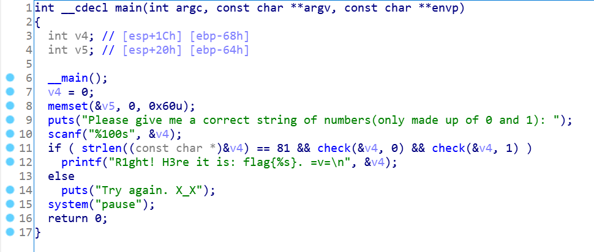
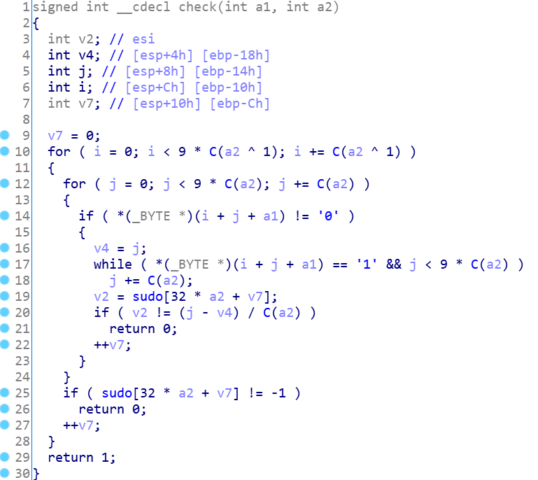
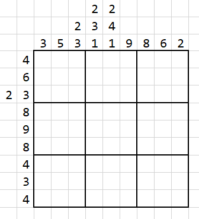
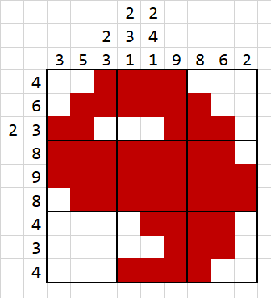

# Not_A_Sudoku

## 题目描述

不要只知道数独啦 :/

## 题目文件

`Not_A_Sudoku.exe`

## Hint

Hint 1： https://cn.puzzle-sudoku.com/ && 不要忘了题目名字0v0

## flag

flag{001111000011111100110001110111111110111111111011111111000011110000001110000111100}

---

## Write up

> Not A Sudoku，不是一个数独，不要看到81和sudo的数组名就想到数独啦（ 
>
> ~~但跟数独也不是毫无关系的x。~~
>
> 这是一个神秘古老而冷门（误）的逻辑游戏，名为数织Nonograms [【数织 - 在线解谜游戏】](https://cn.puzzle-nonograms.com/)（hint也给了这个网站的数独网址，往下翻一下更多解谜游戏就有），应用数织原理的手游也有Two Eyes、PicrossLUNA系列等。

看到伪代码，知道程序逻辑是输入一个长度为81的二进制数字串，且需要通过`check(v4,0)`和`check(v4,1)`。



这里不能通过动态调试的方法获取flag，因为这里的flag其实是用户输入进去的，它只负责测试对不对。

也不能用angr，因为分支太多会爆内存。

所以我们只能通过静态分析`check()`函数来判断怎样的flag才能通过检查。



双击`C()`可以看到其功能是`return x==0? 1:9;`，本来还想科普一波三目运算符的没想到ida给简化了。

关于xor，有`0^1=1, 1^0=0`，即，将参数取反。（逆向科普有认真看的想必对这一条不会陌生！xor还有更多有趣的特性等待你们去挖掘~）

回到`check()`，a2=0时的函数可以简化为：

```c
for(int i=0;i<9*9;i+=9){ //i为行数
    for(int j=0;j<9;j++){ //j为列数
        if(s[i+j]=='0') continue;
        int tmp=j;
        while(s[i+j]=='1'&&j<9) j++;
        if(sudo[x][pos]!=(j-tmp)) return 0;
        else pos++;
    }
    if(sudo[x][pos]!=-1) return 0;
    else pos++;
}
```

于是就很容易可以看出，这是在检验一个9 * 9的图里**每一行中**有多少个连续的1块，每个1块里有多少个1。同理可得，`check(v4,1)`的作用是检验一个9 * 9的图里**每一列中**有多少个连续的1块，每个1块里有多少个1。这些数据都存放在`sudo[]`里，并以`-1`作为每一行/列的界限。

这就是数织游戏的原理。

所以，我们可以画出这样的数织空图：



按照数织的玩法，我们填出下面的图（是一个很简单的9*9非常规数织，熟练的人很快就能填出来了）。



~~和尚玩家直呼眼熟（x）~~

填完以后，按照题目要求，把每一个格子的状态打下来就好了（有色为1，无色为0），然后能够得到flag：

`flag{001111000011111100110001110111111110111111111011111111000011110000001110000111100}`